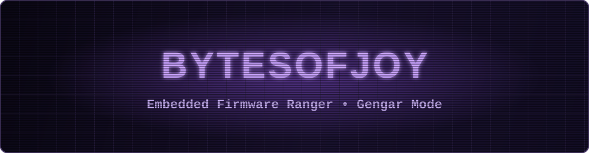

<table align="center" width="92%" border="1" cellpadding="8" cellspacing="0" bgcolor="#2A1F45">
  <tr>
    <td>
      <table align="center" width="100%" border="1" cellpadding="8" cellspacing="0" bgcolor="#1B1530">
        <tr>
          <td align="left"><b>BASIC</b></td>
          <td align="center"><b>BytesOfJoy </b></td>
          <td align="right">
            <b>LV.53 • 130 HP ⚡</b>
          </td>
        </tr>
        <tr>
          <td colspan="3" align="center"><b>Rarity:</b> ⭐⭐⭐⭐⭐ <b>Shadow Legend</b></td>
        </tr>
        <tr>
          <td colspan="3" align="center">
            <table align="center" width="94%" border="1" cellpadding="6" cellspacing="0" bgcolor="#0F0B1D">
              <tr>
                <td align="center">
                  
                </td>
              </tr>
            </table>
          </td>
        </tr>
        <tr>
          <td colspan="3" align="center">
            
             
            <b>Signature Avatar: Gengar</b>
          </td>
        </tr>
        <tr>
          <td colspan="3" align="center"><b>No.001 Embedded Ranger</b> HT: 6'0" WT: 269 lbs.</td>
        </tr>
        <tr>
          <td colspan="3" align="center"><code>C++ • EMBEDDED LINUX • RTOS • ARM</code></td>
        </tr>
        <tr>
          <td colspan="3" align="center"><b>Trainer Bond:</b> 方大同 (Khalil Fong) • <b>Skill Training:</b> Electric Guitar 🎸</td>
        </tr>
        <tr>
          <td colspan="3" align="left">
            <b>🌑 Shadow Pulse</b> <b>90+</b> 
            Board bring-up, RTOS timing tuning, and low-level debug strike.
          </td>
        </tr>
        <tr>
          <td colspan="3" align="left">
            <b>🛡️ Kernel Guard</b> <b>80</b> 
            Harden build chains, isolate regressions, and stabilize release flow.
          </td>
        </tr>
        <tr>
          <td align="left"><b>weakness</b> 😴</td>
          <td align="center"><b>resistance</b> 🐞</td>
          <td align="right"><b>retreat cost</b> ⚙️⚙️</td>
        </tr>
        <tr>
          <td colspan="3" align="center">
            
            
             
            
            
          </td>
        </tr>
        <tr>
          <td colspan="3" align="center">
            <b>Core Weapons:</b> <code>C++</code>, <code>C</code> • <b>Toolchain:</b> <code>CMake</code>, <code>GDB</code>, <code>JTAG</code> ⚡
          </td>
        </tr>
        <tr>
          <td colspan="3" align="center"><code>━━ QUEST LOG ━━</code></td>
        </tr>
        <tr>
          <td colspan="3" align="left"><b>CURRENT:</b> tighten board-level debug 🐛</td>
        </tr>
        <tr>
          <td colspan="3" align="left"><b>NEXT:</b> reusable firmware architecture 🏗️</td>
        </tr>
        <tr>
          <td colspan="3" align="left"><b>RESEARCH:</b> SLAM fundamentals in practice 👁️</td>
        </tr>
        <tr>
          <td colspan="3" align="left"><b>SKILL TRAINING:</b> electric guitar fundamentals and rhythm drills 🎸</td>
        </tr>
        <tr>
          <td colspan="3" align="center"><em>Flavor Text: 表面是影子，内核是秩序；调试到天亮也不退场。</em></td>
        </tr>
        <tr>
          <td colspan="3" align="center">
            
          </td>
        </tr>
      </table>
    </td>
  </tr>
</table>
